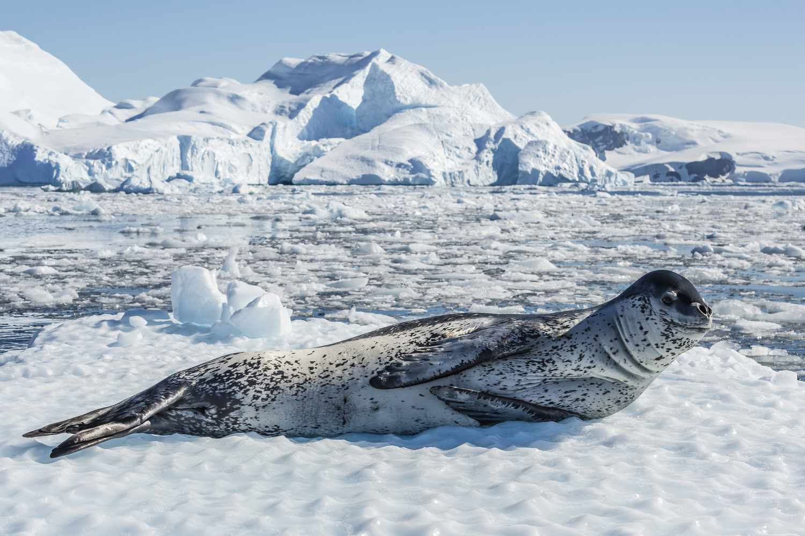
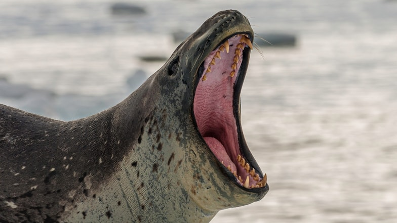

```{r setup, include=FALSE}
knitr::opts_chunk$set(echo = TRUE)
```

# Introduction to the Problem

## The Challenge

Given the issues with our farmed fish, we will need to supplement our
diets with some fish that are wild-caught for a while. These fish are
caught by members of Team Antarctica, but there is quite a bit of risk
involved.

 One of the main hazards to these fishing teams are
[leopard seals](https://en.wikipedia.org/wiki/Leopard_seal). They're
apex predators in this ecosystem and are quite large, averaging 2.4--3.5
m (7.9--11.5 ft) in length and 200-600 kilograms (440-1,320 lb) in
weight. Due to their large size and predatory nature, they can cause
serious injury, especially when large schools of fish are involved ([a
researcher was killed by a leopard seal in Antarctica in
2003](https://www.theguardian.com/uk/2003/jul/24/science.highereducation)).



One way we're working to remove some of this danger is by working with
data from large mammal researchers. They have been tracking leopard
seals using radio collars, one of many ways to track wildlife.

[Wildlife Tracking
Powerpoint](https://docs.google.com/presentation/d/1n-rPHVoB9tydIj_yEQ1TxGTHXn6VWaliRbOszRnbCoc/edit#slide=id.g16730a957e3_0_20)

They have radio collared on a number of seals that live in areas that
could be fished. Fishing boats are equipped with radios that can detect
the presence of seals in the area and avoid high-risk sites.

In recent months, a problem has arisen. Some of the collars are failing,
leading to some very close calls! While attempting to untangle a net,
one team member was pulled into the water when a seal lunged at some
fish trapped in the net.

The large mammal team replaces collars frequently based on the two
manufacturers' recommendations for battery life and general wear and
tear, but it seems as if some of the collars are dying earlier than
expected and putting our team in danger.

We've been tasked with determining why the units are failing and if we
can tie it to a particular manufacturer.

## The Data

Our data on collars is in a file called "collar_data.csv."

```{r}

```

### Explore the Data

1.  Two manufacturers
2.  Battery life: the average number of days a particular collar lasts
    (this is recorded in the unit and stored when the battery dies)
3.  Signal distance: the maximum signal distance at which that
    particular collar has been recorded
4.  Fail: collars that have failed in the past (e.g. they've been
    recovered from seals that were noticed by the team but that didn't
    ping the radio equipment).

#### Group Challenge 1: Summarizing

Let's practice. Write some code to do the following:

-   calculate the mean and sd for:
    -   battery life
    -   signal distance
-   do this for both manufacturers

```{r summarize}

```

We also might want to count up how many collar failures are attributed
to each maker.

```{r}

```

Looks like one of these makers is definitely the one having some
problems!

## Visualizing the Data

After summarizing our data, our next step in our data exploration is
usually data visualization. Let's practice some plotting in `ggplot2` to
remind ourselves how this works!

### One Continuous Variable at a Time

What types of plots can we use to explore one continuous variable (and
one categorical variable--in this case, maker)?

-   multiple histogram
-   multiple density plot
-   box-and-whisker plot

We can start with a histogram of the battery life of the collars.

```{r}

```

We probably want to add in the collar maker to see some differences
there.

```{r}

```

What if we want to add the mean value of each collar maker to the plot?
How do we do that?

One of the neat things about `ggplot2` is that you can actually
reference different data frames within the same plot. We've already
calculated the mean values for each collar maker and saved those values
in a data frame called `bat_life_and_signal`. We can now reference that
data frame and those values and add them to our plot.

We will use the `geom_vline()` function to add a vertical line onto our
plot at the point in the x-axis that represents the mean value. In this
function, we will specifically reference the `bat_life_and_signal` data
frame.

Let's take a look at the help file for `geom_vline()` to see what
arguments it takes. Scroll down to the "Aesthetics" section.

```{r}

```

It looks like we will need to specify the data and the x-intercept, the
place on the x-axis that matches the mean value.

```{r}

```

Nice! We have name the data argument in the `geom_vline()` function
because otherwise the function assumes we still want to use the data
from the `ggplot()` function and gets confused. We are essentially
overwriting that data and telling `geom_vline()` that we need to use a
different data frame.

Let's wrap this up and make it extra nice by adding color, labels, and a
theme.

```{r}

```

#### Group Challenge!

Make the same plot that we made above expect for the signal distance.

```{r}

```

### Two Continuous Variables at a Time

We've explored both battery life and signal distance individually. Now
let's bring them together into one plot to see what the relationship
between them is like. What type of plot will be use for that?

```{r}

```

How do we interpret this plot? What is it telling us about the
relationship between signal distance and battery life? What is it
telling us about that relationship between the two collar makers?

As it turns out, this trade-off between signal distance and battery
lenght is very real when it comes to wildlife tracking! Why do you think
that is?
