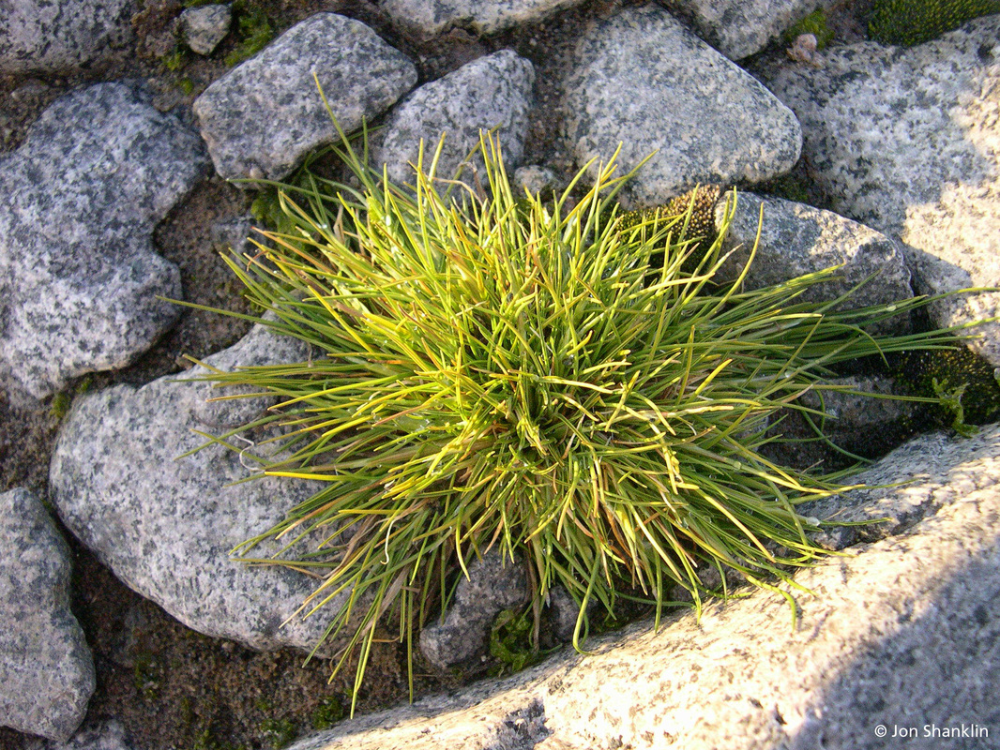
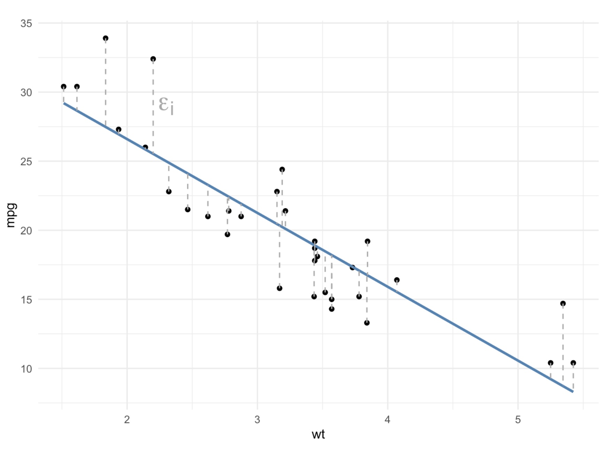
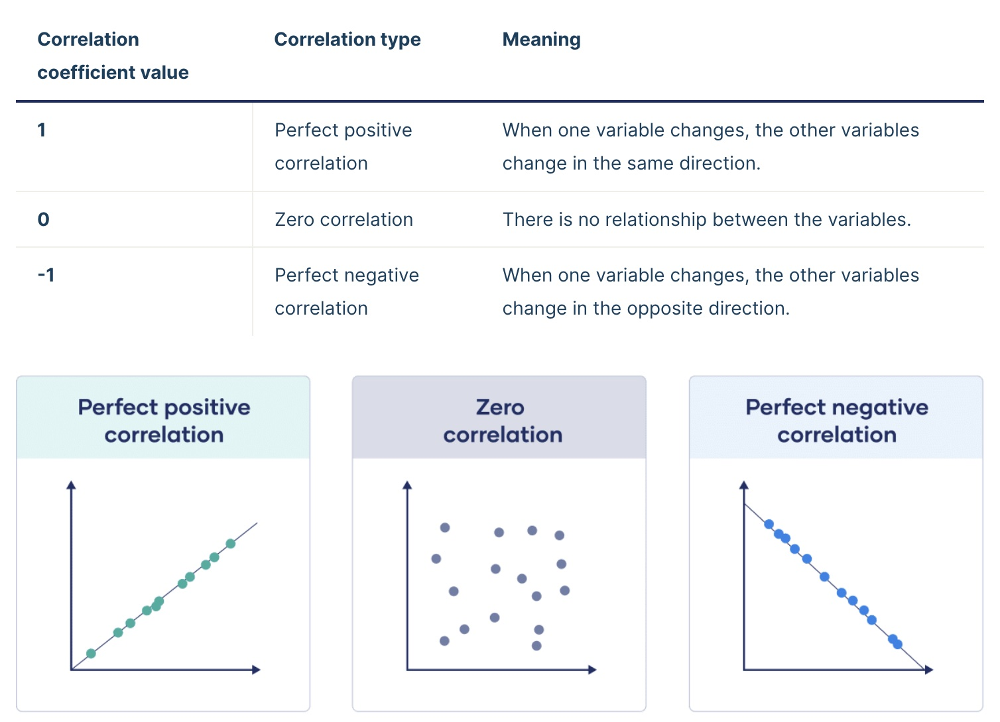
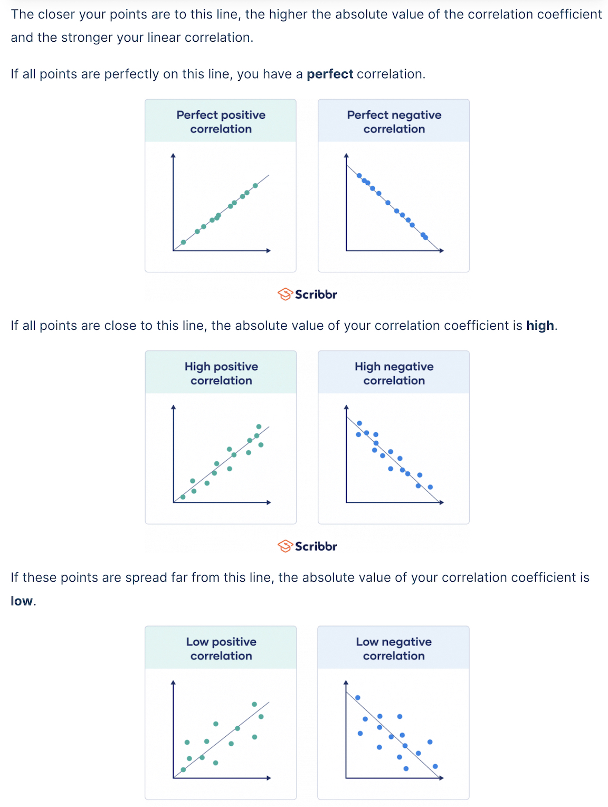
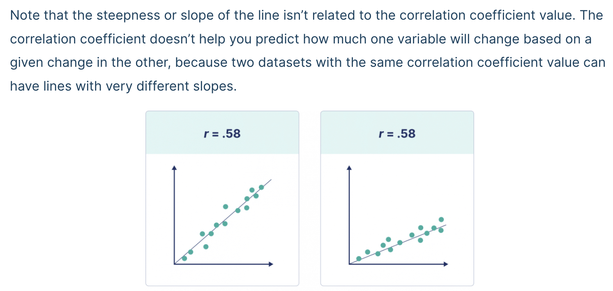

```{r setup, include=FALSE}
knitr::opts_chunk$set(echo = TRUE)
```

# Roads and Regressions

## The Scenario

Last module, we tried to figure out which bays we should prioritize for fishing based on the following data sets:

-   radio collar data
-   fish catch data
-   leopard seal abundance data

Based on our results from Assignment 3, it looks like Sulzberger Bay and Hope Bay are our best bets. Now, we need to make these bays accessible over land to transport the fish we've caught to our home base.

**We want to build a road while minimizing our impact on the delicate antarctic ecosystem.**

Our first order of business is to make sure that we avoid areas with that are well-suited for [Antarctica hair grass](https://oceanwide-expeditions.com/blog/the-plants-of-antarctic) (*Deschamsia antarctica*), one of only two flowering species of plants on the continent.



We want to know what environmental conditions are associated with hair grass. This way, we can avoid areas where these conditions are met and not destroy precious habitat for the hair grass.

It would take far too long to survey every bit of land between our base and our fishing spots, so we are going to build a **model** based on some samples of where hair grass is found to help us predict where else it might be.

### What is a model?

A model is a way for us to take complex systems and break them down into small, more understandable bits. We can use models to help us understand the relationship between different variables. We can then use those model to make predictions based on those relationships.

## Data


Knowing that we would soon be building roads, we asked our botanists to collect data for us on key components of the hairgrass' environment. Since it would take too long to sample everywhere hairgrass grows, they collected data from a sample of the hairgrass population.

Our botanists collected data for the following variables:

-   *soil pH*: most plants prefer mildly acidic to neutral environments
-   *nitrogen (N) content*: as percentage per 100 mL soil sample; important for plant growth and tissue building
-   *phosphorous (P) content*: as percentage per 100 mL soil sample; important for plant growth and tissue building
-   *percent rock*: how rocky the location is; rocks in soil impact water drainage and temperature
-   *max windspeed (mph)*: extreme wind can pose a challenge to plants of all types
-   *average summer temperature (C)*: temperature in the growing season
-   *penguin density*: the number of penguins per 1 m\^2 within 100 m of the sample quadrant for hair grass; penguin poop increases nitrogen content in the system
-   *hairgrass density*: number of individual clumps (tussocks) of hairgrass per 1 m\^2

This data is based on this article: [Parnikoza, et al. 2007](https://doi.org/10.1016/j.polar.2007.10.002)

## Summarize and Visualize

As we see above, there are many environmental conditions that may be associated with hair grass density.

For this lesson, we are going to focus on two: *nitrogen (N) content* and *soil pH*.

### Set-Up

As usual, we start with loading our packages and our data.

```{r}

```

Let's take a look at the data in the data set. What does each row represent?

```{r}

```

### Nitrogen Content

Let's start by investigating any relationship between hair grass density and nitrogen content.

First, we should spend a little time thinking about our variables. Spend a few minutes in small groups discussing the answer to the questions below.

-   Which columns are we interested in right now? 
-   Which one is the independent variable and which is the dependent variable?
    -   independent: 
    -   dependent: 
-   Are the variables categorical or continuous? 
-   Which type of data visualization should we use? 

Next, calculate the mean (`mean()`) and standard deviation (`sd()`) for the nitrogen content.

```{r}

```

Now that we have summarized the data, let's take a look at the data visually.

```{r}

```

Do you see a pattern? What type of relationship do you see?

How do we analyze this type of relationship statistically?

## Statistical Analysis

We are going to use two (related) statistical methods to understand the relationship between two continuous (numeric) variables:

-   correlation coefficient ($r$) and R-squared ($R^2$)
-   linear regression

### Line of Best Fit

To understand the correlation coefficient, R-squared, and linear regression, we first need to talk about something we call the *line of best fit*.

The line of best fit aims to minimize the distance between each observation (points) and the line. The distances between each observation and any line are called *residuals* (the dotted gray lines). The line of best fit is the line that has the smallest *residuals*.

We can add a line of best fit to ggplot by using the `stat_smooth()` function. We need to specify that the method we want should produce a straight line ("linear model").

```{r}
ggplot(hairgrass, aes(N_content, hairgrass_density_m2)) +
  geom_point() +
  stat_smooth(method = "lm")
```

### Correlation Coefficient

The correlation coefficient, `r`, is a measurement of the strength of the relationship between two continuous variables.

The correlation coefficient is a number between -1 and 1 that looks at the relationship between two numeric variables. If the value is negative, there is a negative relationship between the two variable; if the value is positive, there is a positive relationship. 

If all the points fall exactly on the line of best fit, the correlation coefficient with be 1 or -1. If there is no relationship between the variables, `r` is 0 (or something very close to it).


The greater the magnitude (size) of the correlation coefficient, the stronger the relationship between the two variables. 


It is also important to recognize that the correlation coefficient has nothing to do with the slope of the line (we use linear regression to assess that!)



Based on the hairgrass plot we did above, do you expect the correlation coefficient to be positive or negative?

To calculate the correlation coefficient, we need to go back to base R and indicate which columns we are referencing with the `$` operator. We use the `cor()` function.
```{r}
r <- cor(x = hairgrass$N_content, y = hairgrass$hairgrass_density_m2)
```

### R-squared ($R^2$)

The R-squared ($R^2$) value is a representation of how much variation is explained by the line of best fit. When we have a dependent variable and an independent variable, the R-squared value tells us how much of the variation in the *dependent* variable is explained by the *independent* variable.

To calculate R-squared, we square the correlation coefficient value we calculated above. It is always positive because we are squaring it `r` value; that means that R-squared values range from 0 to 1. The closer to 1, the more variation is explained.

```{r}
r^2
```

How would we interpret this `r^2` value?

### Linear Regression Analysis

A regression analysis approximates the relationship between a dependent variable and one or more independent variables. It evaluates the strength of that relationship, ultimately giving us a p-value.

Since we are using linear regressions in this course, the regression model equation will take the form of a line: `y = mx + b`

-   `y` = dependent variable (y-axis)
-   `x` = independent variable (x-axis)
-   `m` = slope of the line
-   `b` = y-intercept

Using our variables, what would our linear regression model look like (we don't know `m` or `b` yet...)?

### Hypothesis Testing

What is the null hypothesis? What is the alternative hypothesis?

**Null Hypothesis** ($H_{0}$): 

**Alternative Hypothesis** ($H_{A}$): 

What do you think this means for the slopes?

### Regression Analysis

Thankfully, R can calculate the slope (`m`) and y-intercept (`b`) of the line of best fit for us.

Let's find the equation for our line of best fit, our test statistic, and our p-value. To do this, we use a function called `lm()`: this stand for "linear model." 

Like with ANOVA, we will then want to use the `summary()` function to get out the values we need.

```{r}

```

As with our other statistical tests---t-tests and ANOVAs---the results give us some important values:

-   `b` (y-intercept): part of our line of best fit equation
    -   The "intercept estimate", in this case 1.385, is our y-intercept in our line of best fit
-   `m` (slope): also part of our line of best fit equation
    -   this is the estimate for our independent variable (N_content in this case)
    -   in this model, m = 0.659
-   *F-statistic*: this is our test statistic
-   *p-value*: calculated from our regression model, used to determine significance (0.05 cut-off, as usual)
-   *R-squared*: this is our R-squared value that we calculated earlier
    -   you can report either the "multiple" or the "adjusted"
    -   the "multiple" will typically match the one we calculate with code

This means our equation for the line of best fit is: y = 0.659x + 1.385 and there is a statistically significant relationship between nitrogen content and hairgrass density.

## Soil pH

Let's do the same series of steps to determine how soil pH impacts hair grass densities. Work on this in your small groups, and we will go over it in about 15 minutes.

Start with summarizing the data: minimum, maximum, mean, and standard deviation.

```{r}

```

Visualize the data. Remember to add in the line of best fit using `ggplot2`.

```{r}

```

Calculate the correlation coefficient (`r`)? What does this tell us?

```{r}

```

How much variation does soil pH explain in the hair grass density data?

```{r}

```

Write out the model for our question about soil pH (without values)?

```{r}
#
```

Run the regression model and write out the equation for the line of best fit.

```{r}

```

Interpret the results of the regression (our p-value cutoff is still = 0.05). What do we conclude about the relationship between soil pH and hair grass density? Why?

## Data-driven Decision Making

The reason we are using regression analysis is to inform where we should (or should not) build our road so we don't harm the sensitive hair grass or take away their prime habitat.

What do results above for nitrogen content and soil pH mean for the road we are building?
