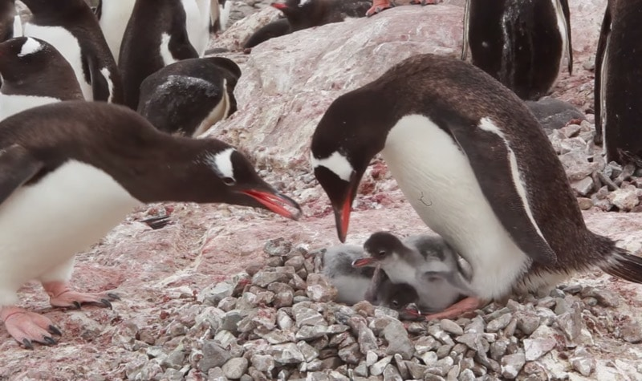

```{r setup, include=FALSE}
knitr::opts_chunk$set(echo = TRUE)
```

# Multiple Regression

Sometimes (often!), we have multiple independent variables that we think might be influencing our dependent variable. In order to take into account more than one variable, we can perform what is called a "multiple regression."

Multiple regressions can become complicated beasts, but we are going to focus on adding in just one additional variable and how it can impact our interpretations.

Let's use some penguins nesting site data to demonstrate.

## Set-Up

As usual, we want to load our packages and our data before we begin.

```{r message = FALSE}
library(tidyverse)
site_data <- read_csv("../data/site_changes.csv") %>% 
  mutate(year = as.factor(year)) # don't worry about this code too much
# we want the year column treated as a category, not a number
```

We want to understand what factors influence penguin nesting---we wouldn't want to build our road through important penguin nesting territories!

Let's quickly take a look at the data we have.

```{r}
head(site_data)
tail(site_data)
```

Okay, it looks like we have data for 100 different sites collected in two different years. We have the number of penguin nests, which is the variable that we are interested in. We also have a few other variables that might be influencing the number of nests at each site: the number of tussocks of grass, the stone size, the distance to water, and the year that data were collected.

Let's start with looking at how the number of grass tussocks affects nest numbers.

### Regression Model (1 Independent Variable)

Let's start by plotting our tussocks data and run a model.

```{r}
ggplot(site_data, aes(x = tussocks, y = num_nests)) +
  geom_point() +
  geom_smooth(method = "lm") +
  theme_classic()
```

This model is showing us a positive relationship between the number of tussocks and number of nests. Let's run our linear regression model.

```{r}
tussocks_model <- lm(num_nests ~ tussocks, data = site_data)
summary(tussocks_model)
```

Our model is telling us that the relationship between the number of nests and number of tussocks is highly significant.

### Running a Multiple Regression

What if we incorporate the year the data were collected into our model? Adding an additional independent variable to our model can change how we interpret the results.

First, let's plot a multiple scatterplot. Do we see the same patterns?

```{r}
ggplot(site_data, aes(x = tussocks, y = num_nests, color = year)) +
  geom_point() +
  geom_smooth(method = "lm") +
  theme_classic()
```

Huh, that looks a little bit different...we no longer seem to have much of a positive relationship. Instead, both lines are looking pretty flat! Let's see what happens when we add year into our regression model.

By adding the year variable into the model, we are also asking if the number of nests changes by year. Does it change our significance?

The way we add an independent variable is with a `+` in the equation.

```{r}
tussocks_model <- lm(num_nests ~ tussocks + year, data = site_data)
summary(tussocks_model)
```

We have a bunch of estimates now! Don't worry, I won't be asking you to put them into an equation :) We are only focusing on significance values.

-   `tussocks`: the p-value for the tussocks row (p = 0.7) shows whether the number of tussocks is a significant driver of nest numbers (it isn't!)
-   `year2011`: this p-value is significant (p = 4.69e-05)---year does seem to impact how many nests there are
    -   (you don't need to know this, but if you are curious...): the reason this says `year2011` and not just `year` is because year is acting as a category, and we can get different coefficient estimates for year. The first option in the categorical variable (1971, in this case) is incorporated into the current intercept estimate, so `year2011` indicates the difference from the original.

### Interactions

Sometimes, we might expect that there will be in interactive effect between the two independent variables we are including in our model.

Let's talk through the visual demonstration below to hopefully get a better understanding of how interaction effects work. These plots are showing different possible relationships between two independent variables: how many cups of coffee someone has had and whether they drank them in the morning or the afternoon (categorical variable), and how those might impact the dependent variable, how long it takes to complete a task.

-   The top two panels show examples of no interactive effect. It looks like there is an effect of time of day; in each, drinking coffee in the morning makes tasks take longer. However, the slopes between time of day are the same. In the first panel (top left), there also looks to be an impact from the number of cups of coffee.
-   The bottom four panels demonstrate possible variations of *interactive* effects. Not only does time of day and/or number of cups of coffee impact how long it takes to complete a task, but those independent variable affect how long it takes to complete a task *in different ways*.


In our example above, an interactive effect between tussocks and year would mean that we think the number of tussocks impacts the number of nests *in different ways* between the two categories (year). Since the slopes between the years don't look very different, we aren't really expecting there to be a significant interaction, but let's check anyway.

Let's run a model that includes the interaction term in our model. To do this, we will use an asterisk (`*`) instead of a plus sign.

```{r}
tussocks_model <- lm(data = site_data, num_nests ~ tussocks * year)
summary(tussocks_model)
```

We can see that we still have estimates for both tussocks and year alone. However, we now also have something new: our interaction term, `tussocks:year2011`.

It turns out that adding in the year variable has changed the significance in our model, and the interaction term is also not significant.

-   The positive relationship we originally observed is no longer present when we account for the year.
-   There is no significant interaction, meaning that penguins respond to the number of tussocks the same way in each year.
-   Interestingly (and maybe frustratingly), the significant effect of year that we saw before is also gone.
    -   This is a confusing bit of statistics, and I won't go into depth here about why this happens. Similar things sometimes happen when we have a significant overall ANOVA but no significant pairwise comparisons.
    -   What is happening behind the scenes has to do with how the information for each variable is being partitioned. Adding new variables (including an interaction) decreases the likelihood of any individual variable being significant.
    -   I will never ask you to explain this! Only to correctly interpret the significance values.

Let's explore another example to get a better understanding.

### Practicing with Stone Size

Let's investigate how stone size influences nest numbers. Gentoo penguins build their nests out of stones (they actually court their penguin partner with stones, too)!



Start by plotting the relationship between stone size and the number of nests.

```{r}
ggplot(site_data, aes(x = stone_size, y = num_nests)) +
  geom_point() +
  geom_smooth(method = "lm")
```

What does the regression model?

```{r}
stone_size_mod = lm(num_nests ~ stone_size, data = site_data)
summary(stone_size_mod)
```

How to we interpret this model?

Next, let's add year in the mix. First, plot the relationship between the number of nests and stone size by year.

```{r}
ggplot(site_data, aes(x = stone_size, y = num_nests, color = year)) +
  geom_point() +
  geom_smooth(method = "lm")
```

This plot looks pretty different from the one with tussocks. First, let's see what happens when we add the year variable *without* the interactive term. To do that, we use a plus sign (`+`), not an asterisk (`*`).

```{r}
stone_size_mod = lm(num_nests ~ stone_size + year, data = site_data)
summary(stone_size_mod)
```

How do we interpret this multiple regression model?

From the ggplot above, we can see that the slopes for the two different years are quite different: one is pretty flat while the other is definitely positive. Different slopes often indicate that an *interaction* might be at work. Let's find out. Run another multiple regression model, this time adding in the interactive effect (`*`).

```{r}
stone_size_mod = lm(num_nests ~ stone_size * year, data = site_data)
summary(stone_size_mod)
```

Wow, a bunch of significant variables! What does that mean, exactly?

Not only are stone size and year significant, but so is the interaction between stone size and year. What does this mean? It means that penguins in different years seems to respond different to stone size. In 1971, the number of nests increases with stone size, but in 2011, the number of nests doesn't seem impacted by stone size. Therefore, there is an *interaction* between stone size and year.

### Resources

Still feeling a bit confused about multiple regression and interactions? I recommend checking out [this website](https://stattrek.com/multiple-regression/interaction?tutorial=reg). You can skip all the equation stuff at the beginning. Below that, though, I think they do a nice job of laying out what interactions are.

Also, if you are interested in how we select which model is the best model, [this article](https://www.statology.org/aic-in-r/) is a decent place to start.
